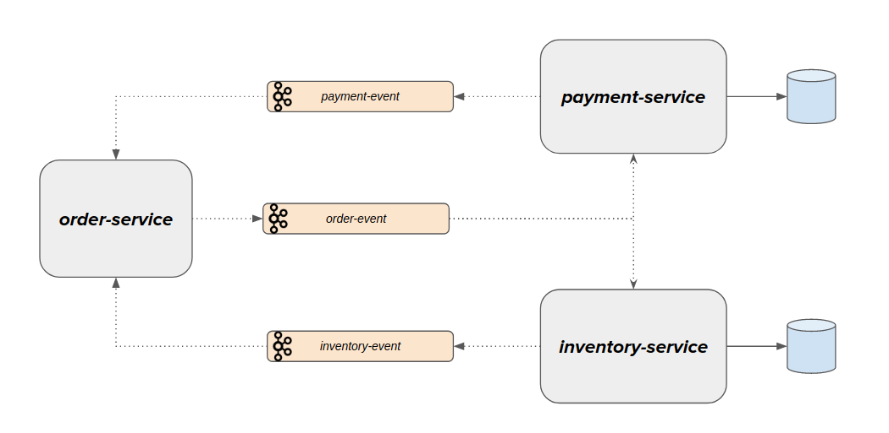

# Saga choreography

## Required

java 11

kafka cluster(docker)

## Description 

## Run

1. install kafka and run;
   go to directory(open in powerShell) `docker-compose.yml`
   docker-compose -f docker-compose.yml up
   (Ctrl+C to exit)or
   docker-compose -f docker-compose.yml up -d
   to stop
   docker-compose down
   to enter into kafka
   docker exec -it kafka /bin/sh
   
2. Run Services: inventory, order, payment

3. Sent Request use postman collection [link to folder](postman)
 
  * 4 times order request (post)
  
  * get orders

